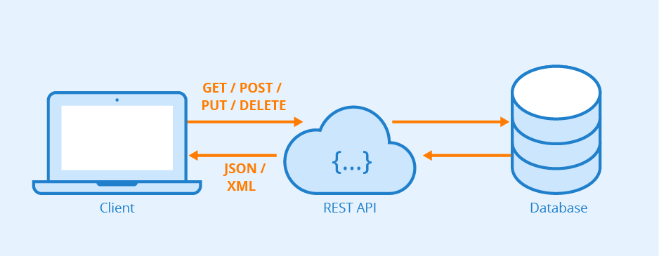

# 🌐 ¿Qué es una API?

Una **API (Application Programming Interface)** permite que dos sistemas se comuniquen entre sí a través de un conjunto de reglas y protocolos. En el contexto web, las **API REST** son las más comunes, y operan sobre HTTP mediante **verbos** que definen el tipo de acción a realizar sobre un recurso.

---

## 🔄 Verbos HTTP Comunes

| Verbo  | Propósito                          | Ejemplo de uso                          |
|--------|------------------------------------|------------------------------------------|
| **POST**   | Crear un nuevo recurso              | Crear un nuevo usuario o factura         |
| **PUT**    | Actualizar completamente un recurso | Modificar todos los datos de un producto |
| **DELETE** | Eliminar un recurso                 | Borrar un cliente del sistema            |
| **GET**    | Obtener datos de un recurso         | Consultar la lista de productos          |

---

## 📘 Documentación de la API: `/api/person`

La ruta `/api/person` permite gestionar información de personas a través de operaciones CRUD (Crear, Leer, Actualizar y Eliminar). A continuación se detallan los métodos disponibles, los verbos HTTP asociados y los atributos del recurso.

### 🧾 Atributos del recurso `person`

| Atributo  | Tipo de dato | Descripción                             |
|-----------|--------------|------------------------------------------|
| `id`      | INT          | Identificador único de la persona        |
| `name`    | VARCHAR      | Nombre                                   |
| `lastname`| VARCHAR      | Apellido                                 |
| `phone`   | VARCHAR      | Número telefónico                        |
| `email`   | VARCHAR      | Correo electrónico                       |
| `estatus` | TINYINT      | Estado del registro (1 = activo, 0 = inactivo) |

---

### 🔄 Endpoints y Métodos

| Método       | Verbo HTTP | Descripción                                         | Endpoint Ejemplo           |
|--------------|-------------|------------------------------------------------------|-----------------------------|
| `all`        | `GET`       | Obtiene la lista completa de personas                | `/api/person`               |
| `findById`   | `GET`       | Consulta los datos de una persona por su ID         | `/api/person/{id}`          |
| `deleteById` | `DELETE`    | Elimina una persona específica por su ID            | `/api/person/{id}`          |
| `save`       | `POST`      | Crea una nueva persona con los datos enviados       | `/api/person`               |
| `update`     | `PUT`       | Actualiza todos los datos de una persona existente  | `/api/person/{id}`          |

---

### 📥 Cuerpo de Solicitud y 📤 Ejemplo de Respuesta

#### 🔹 `GET /api/person`
- **Body de solicitud:** _No aplica_
- **Respuesta:**
```json
[
  {
    "id": 1,
    "name": "Ana",
    "lastname": "Pérez",
    "phone": "3216549870",
    "email": "ana@email.com",
    "estatus": 1
  }
]
```

#### 🔹 `GET /api/person/{id}`
- **Body de solicitud:** _No aplica_
- **Respuesta:**
```json
{
  "id": 1,
  "name": "Ana",
  "lastname": "Pérez",
  "phone": "3216549870",
  "email": "ana@email.com",
  "estatus": 1
}
```

#### 🔹 `DELETE /api/person/{id}`
- **Body de solicitud:** _No aplica_
- **Respuesta:**
```json
{
  "message": "Persona eliminada exitosamente"
}
```

#### 🔹 `POST /api/person`
- **Body de solicitud:**
```json
{
  "name": "Carlos",
  "lastname": "López",
  "phone": "3001234567",
  "email": "carlos@email.com",
  "estatus": 1
}
```
- **Respuesta:**
```json
{
  "id": 5,
  "name": "Carlos",
  "lastname": "López",
  "phone": "3001234567",
  "email": "carlos@email.com",
  "estatus": 1
}
```

#### 🔹 `PUT /api/person/{id}`
- **Body de solicitud:**
```json
{
  "name": "Carlos A.",
  "lastname": "López",
  "phone": "3009876543",
  "email": "carlos.a@email.com",
  "estatus": 1
}
```
- **Respuesta:**
```json
{
  "id": 5,
  "name": "Carlos A.",
  "lastname": "López",
  "phone": "3009876543",
  "email": "carlos.a@email.com",
  "estatus": 1
}
```

---

### 🧩 Resumen de operaciones CRUD

| Operación    | Verbo HTTP | Ruta                       |
|--------------|------------|----------------------------|
| Crear        | `POST`     | `/api/person`              |
| Leer (todos) | `GET`      | `/api/person`              |
| Leer (uno)   | `GET`      | `/api/person/{id}`         |
| Actualizar   | `PUT`      | `/api/person/{id}`         |
| Eliminar     | `DELETE`   | `/api/person/{id}`         |


# Ejemplo gráfico 

